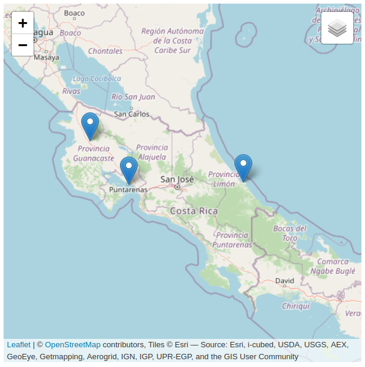

# Leaflet
[Leaflet](https://leafletjs.com/) es una biblioteca de programación en JavaScript para hacer mapas en la Web. Es de código abierto y fue diseñada para funcionar en una gran variedad de dispositivos, incluyendo móviles (ej. celulares, tabletas). Su funcionalidad puede ser extendida a través de [complementos](https://leafletjs.com/plugins.html). Su primera versión fue publicada en 2011 por Vladimir Agafonkin. Junto con [OpenLayers](https://openlayers.org/) y [Google Maps](https://developers.google.com/maps/documentation), es una de las más bibliotecas más populares para programar mapas en la Web.

El código JavaScript de Leaflet se invoca desde documentos en [Lenguaje de Marcas de hipertexto (HTML)](https://html.spec.whatwg.org/). Su código fuente se distribuye junto con un conjunto de [Hojas de Estilo en Cascada (CSS)](https://www.w3.org/Style/CSS/#specs).

## Documentación
La referencia de la interfaz de programación de aplicaciones [(API) de Leaflet](https://leafletjs.com/reference-1.7.1.html) contiene la documentación de las clases, métodos, eventos y demás componentes para la programación en JavaScript. El sitio oficial contiene también un conjunto de [tutoriales y ejemplos](https://leafletjs.com/examples.html).

## Preparativos para el uso
De acuerdo con la [Guía de inicio rápido](https://leafletjs.com/examples/quick-start/), para utilizar Leaflet en un sitio web, primero debe incluirse en el código HTML:

- Un enlace a la hoja CSS de Leaflet.
- Un enlace a la biblioteca JavaScript con el código de Leaflet.
- Un elemento [div](https://developer.mozilla.org/es/docs/Web/HTML/Element/div) para contener el mapa.

Los archivos JavaScript y CSS de Leaflet pueden descargarse del [repositorio de código fuente](https://github.com/Leaflet/Leaflet) o referenciarse a través de enlaces a una [red de distribución de contenidos (CDN)](https://leafletjs.com/download.html).

## Ejemplo de mapa Leaflet básico
Haga clic en la imagen para acceder al mapa interactivo.  
[](https://tpb729-desarrollosigweb-2021.github.io/leccion-05-leaflet/ejemplo-leaflet-basico.html)

Código HTML, CSS y JavaScript

```html
<!DOCTYPE html>
<html lang="es">
<head>
    <meta charset="UTF-8">
    <title>Ejemplo de mapa desarrollado con Leaflet</title>     
    
    <!-- Enlace a hoja CSS de Leaflet -->
    <link rel="stylesheet" href="https://unpkg.com/leaflet@1.7.1/dist/leaflet.css" integrity="sha512-xodZBNTC5n17Xt2atTPuE1HxjVMSvLVW9ocqUKLsCC5CXdbqCmblAshOMAS6/keqq/sMZMZ19scR4PsZChSR7A==" crossorigin=""/>
    
    <!-- Enlace a biblioteca JavaScript de Leaflet -->
    <script src="https://unpkg.com/leaflet@1.7.1/dist/leaflet.js" integrity="sha512-XQoYMqMTK8LvdxXYG3nZ448hOEQiglfqkJs1NOQV44cWnUrBc8PkAOcXy20w0vlaXaVUearIOBhiXZ5V3ynxwA==" crossorigin=""></script>    
</head>
<body>
    <h1>Ejemplo de mapa desarrollado con Leaflet</h1>     
    
    <!-- Elemento div para contener el mapa Leaflet -->
    <div id="mapid" style="height: 500px; width: 500px;"></div>

    <!-- Código JavaScript para generar mapa Leaflet -->
    <script>
	// Mapa Leaflet
	var mapa = L.map('mapid').setView([10, -84], 7);

	// Capa base
	var osm = L.tileLayer(
	  'https://{s}.tile.openstreetmap.org/{z}/{x}/{y}.png?', 
	  {
	    maxZoom: 19,
	    attribution: '&copy; <a href="https://www.openstreetmap.org/copyright">OpenStreetMap</a> contributors'
	  }
	).addTo(mapa);		
	    
	// Otra capa base
        var esri = L.tileLayer(
	  'https://server.arcgisonline.com/ArcGIS/rest/services/World_Imagery/MapServer/tile/{z}/{y}/{x}', 
	  {
            attribution: 'Tiles &copy; Esri &mdash; Source: Esri, i-cubed, USDA, USGS, AEX, GeoEye, Getmapping, Aerogrid, IGN, IGP, UPR-EGP, and the GIS User Community'
	  }
	).addTo(mapa);	    
	    
	// Marcadores
	liberia = L.marker([10.633333, -85.433333]);
	liberia.bindTooltip("Liberia").openTooltip();
	liberia.addTo(mapa);
	    
	limon = L.marker([10.002216, -83.084037]);
	limon.bindTooltip("Limón").openTooltip();
	limon.addTo(mapa);	   
	    
	puntarenas = L.marker([9.966667, -84.833333]);
	puntarenas.bindTooltip("Puntarenas").openTooltip();
	puntarenas.addTo(mapa);	    	    
	        
	// Conjunto de capas base
	var mapasBase = {
	    "ESRI": esri,		
	    "OSM": osm
	};	    
	    
	// Control de capas
        L.control.layers(mapasBase).addTo(mapa);	    
    </script>									    
</body>
</html>
```

## Clases del API de Leaflet
### Clase Map
La clase [Map](https://leafletjs.com/reference-1.7.1.html#map) es la clase central del API de Leaflet. Se utiliza para crear un mapa y manipularlo.

```javascript
// Mapa Leaflet
var mapa = L.map('mapid').setView([10, -84], 7);
```

### Método setView()
El método [setView()](https://leafletjs.com/reference-1.7.1.html#map-setview) asigna una vista (centro y nivel de acercamiento) y niveles de animación al mapa.

```javascript
// Definición de la vista de un mapa
map.setView(L.latLng([10, -84]), 10);	
```

### Clase TileLayer
La clase [TileLayer](https://leafletjs.com/reference-1.7.1.html#tilelayer) se utiliza para desplegar capas de teselas.

```javascript
// Despliegue de la capa de OpenStreetMap
L.tileLayer(
  'https://{s}.tile.openstreetmap.org/{z}/{x}/{y}.png?', 
  {
    maxZoom: 19,
    attribution: '&copy; <a href="https://www.openstreetmap.org/copyright">OpenStreetMap</a> contributors'
  }
)
```

En [Leaflet Provider Demo](https://leaflet-extras.github.io/leaflet-providers/preview/) puede verse una lista de proveedores de capas de teselas.

### Clase Marker
La clase [Marker](https://leafletjs.com/reference-1.7.1.html#marker) se utiliza para desplegar marcadores en el mapa.

Puede utilizarse conjuntamente con las clases [Popup](https://leafletjs.com/reference-1.7.1.html#popup) y [Tooltip](https://leafletjs.com/reference-1.7.1.html#tooltip), para desplegar información en ventanas emergentes.

```javascript
// Marcador para la Catedral Metropolitana de San José
var catedralSJMarker = L.marker([9.9326673, -84.0787633])

catedralSJMarker.bindPopup('<a href="https://es.wikipedia.org/wiki/Catedral_metropolitana_de_San_Jos%C3%A9">Catedral Metropolitana de San José</a>.<br>Catedral de estilo clásico y barroco. Templo principal de la arquidiócesis católica de San José.<br>Construída entre 1825 y 1827 y reconstruída en 1878.').openPopup();
catedralSJMarker.bindTooltip("Catedral Metropolitana de San José").openTooltip();
```

Varios sitios web ofrecen íconos que pueden utilizarse como marcadores personalizados como, por ejemplo, [Font Awesome](https://fontawesome.com/). Para utilizarlos, siga la documentación en [Font Awsome 5 Intro](https://www.w3schools.com/icons/fontawesome5_intro.asp) y [Basic Use - Font Awsome](https://fontawesome.com/how-to-use/on-the-web/referencing-icons/basic-use). Puede ver un ejemplo de su uso en [https://tpb729-desarrollosigweb-2021.github.io/ejemplo-mapa-leaflet-iconos-fa/](https://tpb729-desarrollosigweb-2021.github.io/ejemplo-mapa-leaflet-iconos-fa/).

### Clase Control
La clase [Control](https://leafletjs.com/reference-1.7.1.html#control) es la clase base para implementar controles en un mapa. Todas las clases de controles heredan de esta clase. Ejemplos de clases de controles: 

* [Zoom](https://leafletjs.com/reference-1.7.1.html#control-zoom): botones de acercamiento y alejamiento.
* [Attribution](https://leafletjs.com/reference-1.7.1.html#control-attribution): datos de atribución (ej. autoría).
* [Layers](https://leafletjs.com/reference-1.7.1.html#control-layers): activa y desactiva capas.
* [Scale](https://leafletjs.com/reference-1.7.1.html#control-scale): añade una escala.

**Ejercicios**  
En el mapa de ejemplo:

1. Agregue dos capas base.
2. Agregue un marcador para San José.
3. En los marcadores, agregue ventanas de *popup* con el nombre de cada ciudad (o cantón) y un enlace a la página correspondiente en [Wikipedia](https://es.wikipedia.org/).
4. Personalice los marcadores (al menos uno) con íconos de Font Awsome.
5. Agregue un control de escala.
6. Publique su mapa en [GitHub Pages](https://pages.github.com/) y organice su código en archivos y subdirectorios separados para:
    - archivos CSS (css/\*.css).
    - archivos JavaScript (js/\*.js).  

Su archivo HTML (ej. index.html) debe hacer referencia a los archivos CSS y JavaScript contenidos en los subdirectorios.
